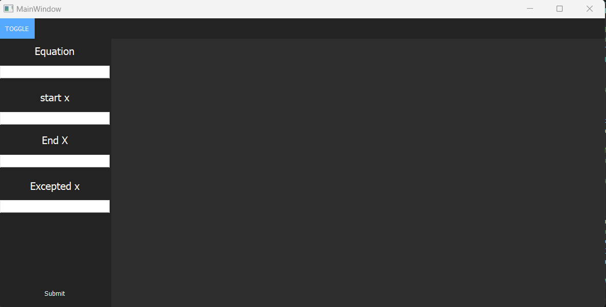
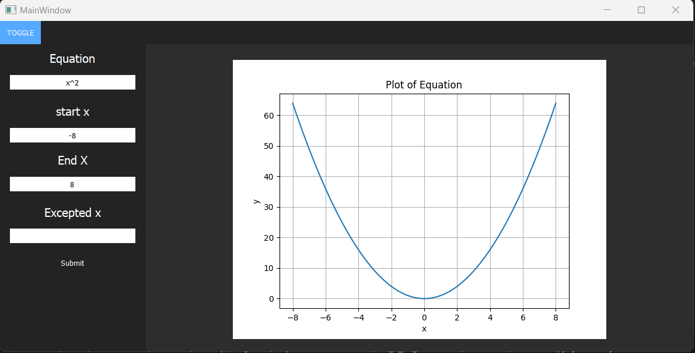
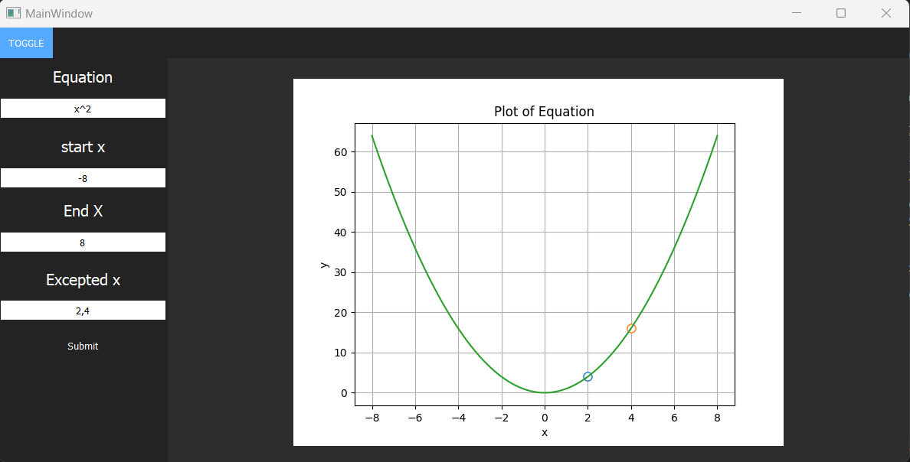
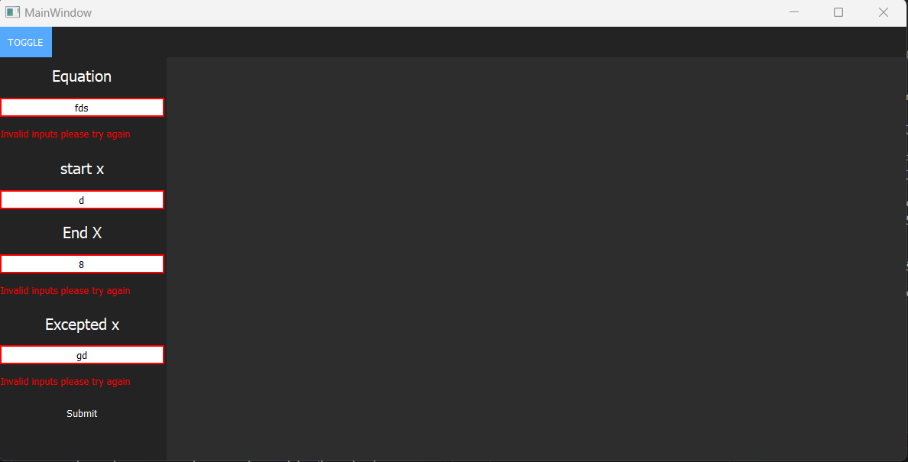
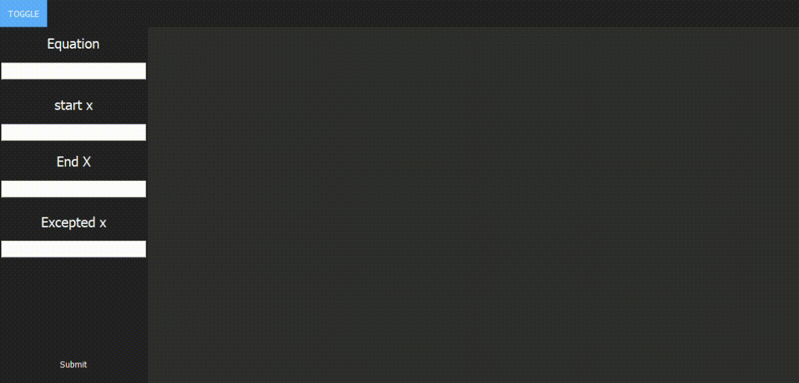

# Master_Microcontroller_Tasks
   
# Libraries Versions

- pyside2 :version 5.15.2.1
- matplotlib : version 3.3.4

- numpy :  version 1.22.2

  ------

# To open UI

- main file name is main.py.

- after enter valid inputs that will show

if you enter excepted values for x plot will be 

if you enter invalid inputs that will be shown

that is a simple demo about task

